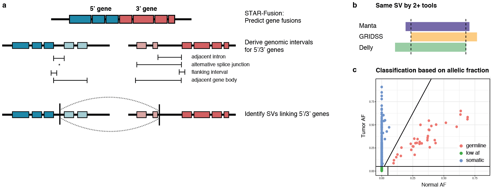
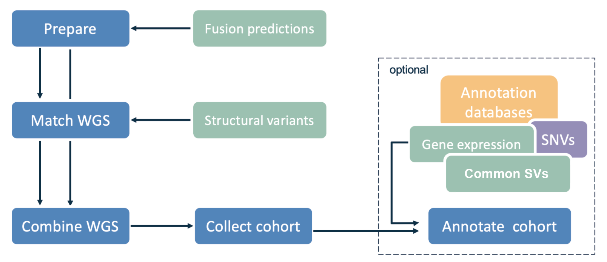

# Fusion-sq: resolving tumor-specific gene fusions

## Background
Gene fusions are an important class of driver mutations in many (pediatric) cancers and their detection is essential for diagnosis and treatment selection. The currently standard-of-care targeted assays are precise, but limited to know breakpoints and partner genes making them unsuitable for discovery of novel fusions and prone to missing fusions with non-canonical breakpoints/partner genes.
RNA-seq based methods can detect fusions genome-wide in theory, but in practice they suffer from a high false positive rate and require extensive (manual) filtering. Also, chimeric transcripts have been detected in many healthy cells as well in the past few years, highlighting the importance of differentiating between those healthy-occurring chimera and tumor-specific events.

## Approach 
Fusion-sq combines RNA-seq with WGS to accurately resolve gene fusions and the underlying structural variants (SVs) that are specific to the tumor. 
RNA-DNA breakpoints are matched taking into account the intron-exon gene structure (Figure 1a). 
Gene fusions are further filtered to a high-confidence subset based on agreement on the resolved SV by at least two SV tools (>50% reciprocal overlap) (Figure 1b). 
Next, allele fractions of underlying SVs fusions are used to categorise fusions into tumor-specific, germline, and low AF (Figure 1c)

An overview of the pipeline in Figure 2 shows the basic data flow. 

* Prepare matching: starting from gene fusion predictions from RNA-seq (STAR-Fusion), derive matching intervals for 5'/3' fusion partner genes.
* Match WGS: find SVs that link the 5'/3' partner genes, takes as input SVs called by Delly, Manta, and/or GRIDSS. 
* Combine WGS: integrates the support from each tool for each predicted fusion; summarizes multiple predictions for the same 5'/3' partner gene pair (if applicable).
* Collect cohort: makes an overview of all fusions across all patients.
    *   Optional: overlap gene fusion SVs with common population SVs.
    *   Optional (not part of Fusion-sq): gene expression analysis (retrieve z-scores), overlap SVs with copy number alterations (CNA) from patient's read-depth data, add SNVs
* Annotate SVs: annotate SV breakpoints relative to introns, overlapping repeat regions and segmental duplications
* Annotate cohort:  annotate with external databases with chimeric transcripts and gene annotation (see below), and merge with the optional analyses.
* Make supplementary: performs cohort-level analyses such as gene fusion recurrence, mapping fusions resolved in individual patients to unique fusion events and making a patient-level overview table

## Getting started 

Test data is provided for a patient carrying two gene fusions: EML4--NTRK3 and LINC01237--LINC01881. The NTRK3 fusions is a known clinically relevant gene fusion and LINC01237--LINC01881 a healthy chimera that overlaps a population SV.

Please configure paths in `R/default.conf`, make sure you retrieve the required resources in `resources/get_resources.sh`

`bash run_test_data.sh`

## Software requirements

Software used for gene fusion predictions and SV calling:

* STAR Fusion version 1.8.0
    *   Haas BJ, Dobin A, Stransky N, et al (2017) STAR-Fusion: Fast and Accurate Fusion Transcript Detection from RNA-Seq. bioRxiv 120295
* Manta version 1.6
    *   Chen X, Schulz-Trieglaff O, Shaw R, Barnes B, Schlesinger F, Källberg M, Cox AJ, Kruglyak S, Saunders CT (2016) Manta: rapid detection of structural variants and indels for germline and cancer sequencing applications. Bioinformatics 32:1220–1222
* DELLY version 0.8.1
    *   Rausch T, Zichner T, Schlattl A, Stutz AM, Benes V, Korbel JO (2012) DELLY: structural variant discovery by integrated paired-end and split-read analysis. Bioinformatics 28:i333–i339
* GRIDSS version 2.7.2
    *   Cameron DL, Schröder J, Penington JS, Do H, Molania R, Dobrovic A, Speed TP, Papenfuss AT (2017) GRIDSS: sensitive and specific genomic rearrangement detection using positional de Bruijn graph assembly. Genome Research 27:2050–2060
	
	
Fusion-sq needs the following configuration to run

* R version 4.0
* Bioconductor version 3.12

Packages:

* GenomicRanges
* VariantAnnotation
* StructuralVariantAnnotation
* rtracklayer
* ensembldb
* tidyverse
* dplyr
* stringr
* stringdist

## External resources  

Cancer chimeric transcripts and gene datasets:

* ChimerDB 4.0 (retrieved on 2021-02-17) 
    *   Jang YE, Jang I, Kim S, et al (2020) ChimerDB 4.0: an updated and expanded database 
* Mitelman database (v20201015, retrieved on 2021-01-07)
    *   Mitelman F, Johansson B, Mertens F (2007) The impact of translocations and gene fusions on cancer causation. Nature Reviews Cancer 7:233–245
* COSMIC (cancer gene census v92)
    *   Tate JG, Bamford S, Jubb HC, et al (2019) COSMIC: the Catalogue Of Somatic Mutations In Cancer. Nucleic Acids Res 47:D941–D947
* OncoKB (accessed on 2021-04-14) 
    *   Chakravarty D, Gao J, Phillips SM, et al (2017) OncoKB: A Precision Oncology Knowledge Base. JCO Precis Oncol. https://doi.org/10.1200/PO.17.00011
* Gröbner et al., recurrently mutated genes in pediatric cancer.
    *   Gröbner SN, Worst BC, Weischenfeldt J, et al (2018) The landscape of genomic alterations across childhood cancers. Nature 555:321–327

Gene annotation:

* Gencode annotation version 31
    *   https://www.gencodegenes.org/human/release_31.html
* CTAT resource genome lib version GRCh38_gencode_v31_CTAT_lib_Oct012019
    *   https://data.broadinstitute.org/Trinity/CTAT_RESOURCE_LIB/__genome_libs_StarFv1.8/
* Human transcription factors v1.01
    *   Lambert SA, Jolma A, Campitelli LF, Das PK, Yin Y, Albu M, Chen X, Taipale J, Hughes TR, Weirauch MT (2018) The Human Transcription Factors. Cell 172:650–665
* Human protein kinases
    *   Manning G, Whyte DB, Martinez R, Hunter T, Sudarsanam S (2002) The protein kinase complement of the human genome. Science 298:1912–1934

Genome annotation retrieved from the UCSC table browser: 

* Repeats from RepeatMasker (LINE, SINE, LTR) 
* Segmental duplications
* Chromosome bands
    *   Navarro Gonzalez J, Zweig AS, Speir ML, et al (2020) The UCSC Genome Browser database: 2021 update. Nucleic Acids Res 49:D1046–D1057

SVs in the general population:

* NCBI Curated Common Structural Variants (nstd186)
    *   dbVar. https://www.ncbi.nlm.nih.gov/dbvar/studies/nstd186/. 
* gnomAD Structural Variants (nstd166)
    *   Collins RL, Brand H, Karczewski KJ, et al (2020) A structural variation reference for medical and population genetics. Nature. https://doi.org/10.1038/s41586-020-2287-8
* DGV (version 2020-02-25) 
     *   MacDonald JR, Ziman R, Yuen RKC, Feuk L, Scherer SW (2014) The Database of Genomic Variants: a curated collection of structural variation in the human genome. Nucleic Acids Res 42:D986–92

